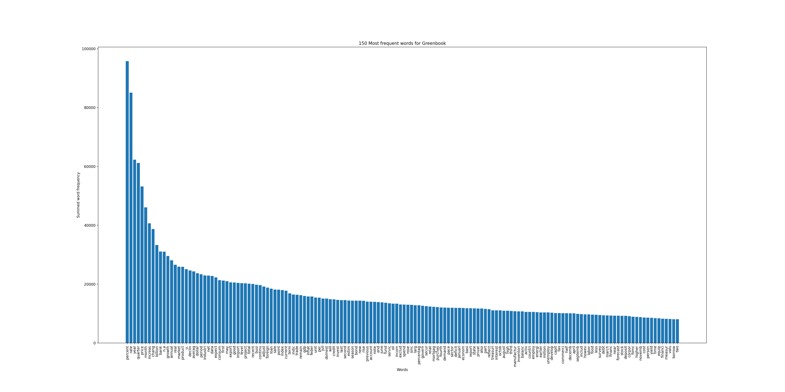
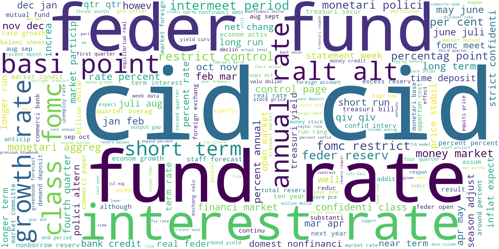
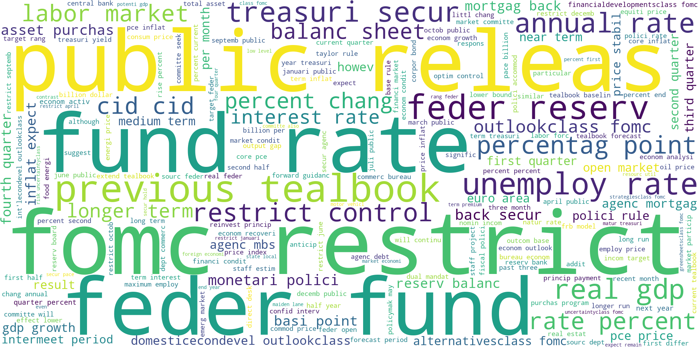
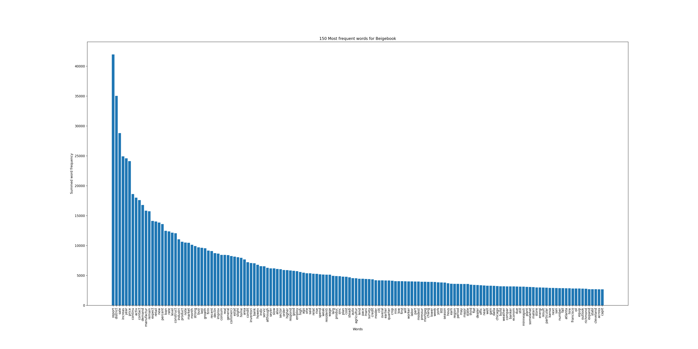
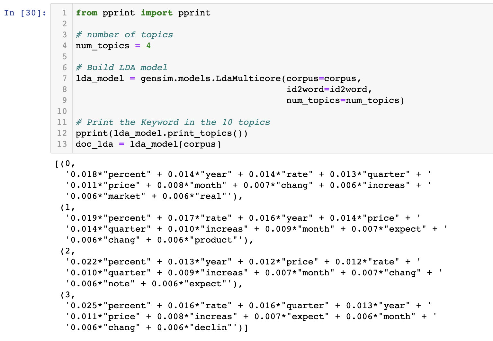
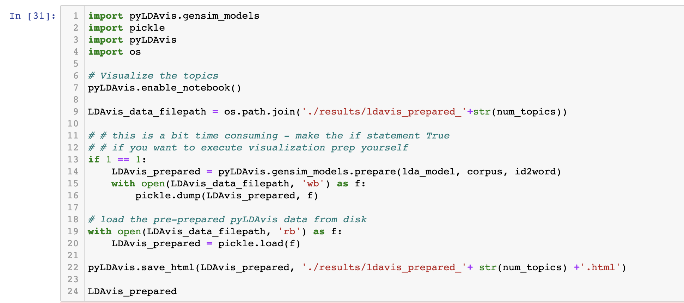
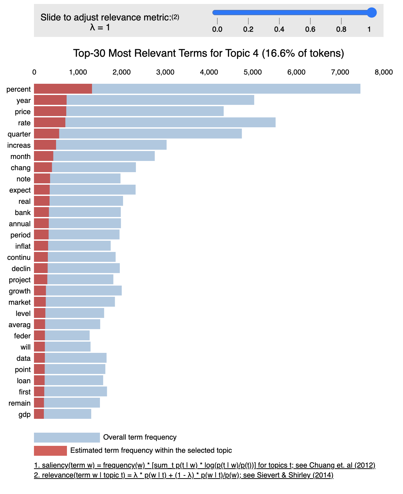

# Latent Dirichlet Allocation on FOMC Historical Materials

In natural language processing, Latent Dirichlet Allocation (LDA) is a generative statistical model used for topic modelling. While LDA was originally invented in context of population genetics, it is applied in machine learning for topic discovery. Topic discovery is a problem in NLP where the goal is to discover topics in a collection of documents, and then automatically classify any individual document within the collection in terms of how relevant it is to each of the discovered topics. In this context, a topic is considered a set of terms, that when collected together they suggest a shared theme. 

Here are some assumptions for LDA that we need to take into account.
1. The semantic content of a document is composed by combining one or more terms from one or more topics.
2. Certain terms are ambiguous, belonging to more than one topic, with different probability.
3. Within a topic, certain terms will be used much more frequently than others. In other words, the terms within a
topic will also have their own probability distribution.
4. We know beforehand how many topics we want, we decide on k topics to discover.
5. Each document is just a collection of words or a “bag of words”. Thus, the order of the words and the grammatical role of the words (subject, object, verbs, …) are not considered in the model.
6. Stop words like am/is/are/of/a/the/but/… don’t carry any information about the “topics” and therefore can be eliminated from the documents as a preprocessing step. 

The dataset in question today is the Federal Open Market Committee Historical Materials. The Federal Reserve publishes colored books that go over different topics for US economics.
1. Greenbook: Current Economic & Financial Conditions
2. Tealbook: Economic & Financial Conditions: Current Situation & Outlook + Monetary Policy: Strategies & Alternatives
3. Beigebook: Summary of Commentary on Current Economic Conditions by Federal Reserve District
4. Bluebook: Monetary Policy Alternatives

The publically available form of these historical materials are in downloadabe pdf form. 

## Data Processing
To execute the Latent Dirichlet Allocation on the historical materials we need to go through several steps. Each steps is completed in the corresponding python script, python notebook or R script file. [To have a look at the original scripts please have a look at my github repository.](https://github.com/haruka-takagi-datascience/textual_analysis)

1. 01_LDAproj_pdfconvert.py: The purpose of this script is to take the FOMC_PDF_Historical_Materials_Links and turn the links into files of pdf's per column. For example, running this script will generate a 'green book' folder of pdf files.

2. 02_LDAproj_textconvert.py: The purpose of this script is to take the FOMC pdf files and convert them to text files for easier access and pre-processing.

3. 03_LDAproj_removetables.py: The purpose of this script is to take the FOMC_Historical_Materials_textfiles and remove tables from the text files.

4. 04_LDAproj_cleantextfiles.R: The purpose of this script is to take the FOMC text files and make them cleaner. Remove spaces over two character lengths long, remove numbers, punctuation, and new line characters. Output text files will not keep any formatting elements. 

5. 05_LDAproj_samedatecombination.R: The purpose of this script is to combine text files that have the same date. And get rid of the first page in some text files. (trim function). Run just on tealbook, greenbook & greenbook_mini.

6. 06_LDAproj_dfmcreation.R: The purpose of this script is to create a csv file of a dataframe with all texts and create a document frequency matrix. Preprocess file consists of combined Greenbook_mini, Greenbook & Tealbook + cleaned version of Beigebook and Bluebook. Manually copy files into preprocess file.

7. 07_LDAproj_wordcloud.ipynb: The purpose of this script is to create a word cloud for the FOMC historical documents.

8. 08_LDAproj_wordstats.ipynb: The purpose of this script is produce graphs on the word frequency and give general statistics to understand our data set better. 

## Data Exploration

Before we execute LDA, we would like to get an idea of the most frequent words in the data first. This way we can remove some of the unneccesary words that slipped through the cracks in the cleaning procedure. 07_LDAproj_wordcloud.ipynb and 08_LDAproj_wordstats.ipynb produce word clouds and statistics on the most frequent words in the dataset. 

### Greenbook

  
  

Some of the 10% most frequent words in the Greenbook in decreasing frequency order.

percent rate year quarter price month increas chang billion bank n.a growth annual real market product u. declin averag dollar period industri net data expect consum first may export good import level project total recent busi continu adjust foreign loan sale point index current term indic trade remain gdp inflat feder unit per juli domest will credit invest last second estim season bond new rise

### Bluebook

  
  

Some of the 10% most frequent words in the Bluebook in decreasing frequency order. 

rate cid percent growth market fund year feder reserv altern period inflat month quarter term expect polici may committe bank fomc rang point level averag treasuri monetari price credit money adjust increas yield chang debt interest deposit annual aggreg end project run short june week recent dollar borrow declin econom data estim basi base secur time total will staff real alt continu juli meet remain jan current billion

### Tealbook

  
  

Some of the 10% most frequent words in the Tealbook in decreasing frequency order. 

rate percent inflat quarter feder tealbook year price fomc market expect polici project fund committe term secur restrict public increas releas real previous will purchas econom chang growth treasuri altern bank month continu gdp reserv remain period point unemploy current rule balanc forecast level billion pace loan asset labor note estim end staff declin may agenc first condit financi u. recent outlook averag indic effect control sourc annual run longer report lower mortgag

### Beigebook

  
  

Some of the 10% most frequent words in the Beigebook in decreasing frequency order.

report district sale increas year price continu activ contact demand manufactur remain expect retail new percent loan rate level construct industri product note market month strong busi last growth firm recent declin improv consum real general commerci estat slight home area condit inventori bank howev indic servic although sever slow also sector order higher respond good employ high ago one said relat rise

### Data Exploration Takeaways
From these results I have compiled a list of word that we should drop from the dataset before we run the LDA.
I have updated 03_LDAproj_cleantextfiles.R to drop the words listed below. 
- months: oct, october, etc
- words with symbols or punctuation in between them
- time (months + quarter)
- date
- seasonality
- locations
- measure words (percentage, point, rate…)
- drop words with a summed word frequency of less than 5
- quantity words (million, hundred, thousands)

## Execute Latent Dirichlet Allocation
The script we will be examining is 09_LDAproj_LDAimplementation.ipynb.
We will be using the gensim topic modelling package for the LDA model.
We will also be using the Greenbook as our example in this project. But feel free to run the other LDA's for the other books as well.

Lets read in our dataset.  

  

Then prepare the text for LDA analysis and construct a corpora.  

  

Then lets build and train our LDA model.  

  

Then lets visualize the results of our LDA model.  

  

We can examine the intertopic distance mapping of our topics. I have decided on 4 topics as this number of topics had the least overlap between each other.  

  

Below are the Top 30 Most Relevant Terms for Topics 1 to 4 for a lambda = 1 relevance metric.  

  
  
  
  

This concludes the textual analysis project! Thank you for taking a look and reading till the end!
Please check out my other projects if you have the time!

