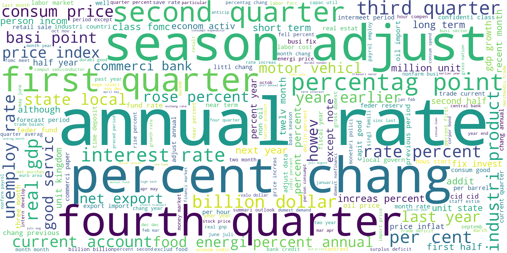
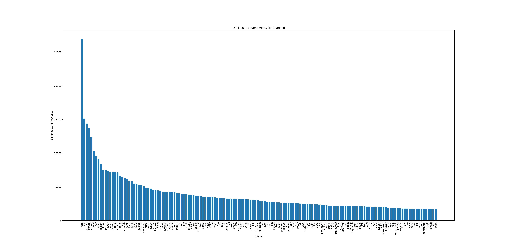
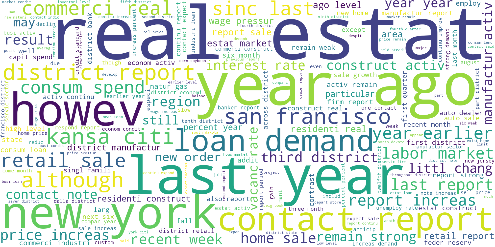

# Latent Dirichlet Allocation on FOMC Historical Materials

In natural language processing, Latent Dirichlet Allocation (LDA) is a generative statistical model used for topic modelling. While LDA was originally invented in context of population genetics, it is applied in machine learning for topic discovery. Topic discovery is a problem in NLP where the goal is to discover topics in a collection of documents, and then automatically classify any individual document within the collection in terms of how relevant it is to each of the discovered topics. In this context, a topic is considered a set of terms, that when collected together they suggest a shared theme. 

Here are some assumptions for LDA that we need to take into account.
1. The semantic content of a document is composed by combining one or more terms from one or more topics.
2. Certain terms are ambiguous, belonging to more than one topic, with different probability.
3. Within a topic, certain terms will be used much more frequently than others. In other words, the terms within a
topic will also have their own probability distribution.
4. We know beforehand how many topics we want, we decide on k topics to discover.
5. Each document is just a collection of words or a “bag of words”. Thus, the order of the words and the grammatical role of the words (subject, object, verbs, …) are not considered in the model.
6. Stop words like am/is/are/of/a/the/but/… don’t carry any information about the “topics” and therefore can be eliminated from the documents as a preprocessing step. 

The dataset in question today is the Federal Open Market Committee Historical Materials. The Federal Reserve publishes colored books that go over different topics for US economics.
1. Greenbook: Current Economic & Financial Conditions
2. Tealbook: Economic & Financial Conditions: Current Situation & Outlook + Monetary Policy: Strategies & Alternatives
3. Beigebook: Summary of Commentary on Current Economic Conditions by Federal Reserve District
4. Bluebook: Monetary Policy Alternatives

The publically available form of these historical materials are in downloadabe pdf form. 

## Data Processing
To execute the Latent Dirichlet Allocation on the historical materials we need to go through several steps. Each steps is completed in the corresponding python script, python notebook or R script file.

1. 01_LDAproj_pdfconvert.py: The purpose of this script is to take the FOMC_PDF_Historical_Materials_Links and turn the links into files of pdf's per column. For example, running this script will generate a 'green book' folder of pdf files.

2. 02_LDAproj_textconvert.py: The purpose of this script is to take the FOMC pdf files and convert them to text files for easier access and pre-processing.

3. 03_LDAproj_removetables.py: The purpose of this script is to take the FOMC_Historical_Materials_textfiles and remove tables from the text files.

4. 04_LDAproj_cleantextfiles.R: The purpose of this script is to take the FOMC text files and make them cleaner. Remove spaces over two character lengths long, remove numbers, punctuation, and new line characters. Output text files will not keep any formatting elements. 

5. 05_LDAproj_samedatecombination.R: The purpose of this script is to combine text files that have the same date. And get rid of the first page in some text files. (trim function). Run just on tealbook, greenbook & greenbook_mini.

6. 06_LDAproj_dfmcreation.R: The purpose of this script is to create a csv file of a dataframe with all texts and create a document frequency matrix. Preprocess file consists of combined Greenbook_mini, Greenbook & Tealbook + cleaned version of Beigebook and Bluebook. Manually copy files into preprocess file.

7. 07_LDAproj_wordcloud.ipynb: The purpose of this script is to create a word cloud for the FOMC historical documents.

8. 08_LDAproj_wordstats.ipynb: The purpose of this script is produce graphs on the word frequency and give general statistics to understand our data set better. 

## Data Exploration

Before we execute LDA, we would like to get an idea of the most frequent words in the data first. This way we can remove some of the unneccesary words that slipped through the cracks in the cleaning procedure. 07_LDAproj_wordcloud.ipynb and 08_LDAproj_wordstats.ipynb produce word clouds and statistics on the most frequent words in the dataset. 

### Greenbook

### Bluebook

### Tealbook

### Beigebook

